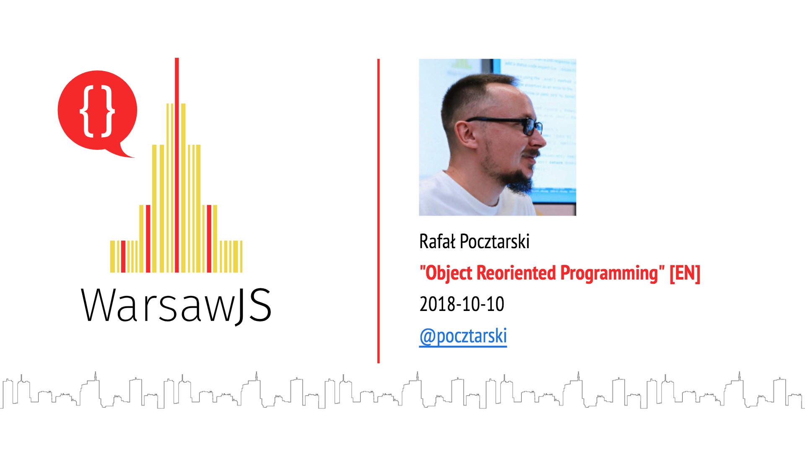

---

# Rafał Pocztarski

You may know me from Stack Overflow

# pocztarski.com

Enough about me

---

# Object Reoriented Programming

Going back to the fundamentals of OOP 
in JavaScript and TypeScript

---

My first contact with OOP was with C++

I didn't like it and came back to C

---

Objects were like structs

Method were like functions

I wasn't impressed

---

Started writing in JavaScript

Much simpler OOP but not that useful

Nothing compared to FP

---

Then I saw an interesting quote

---

"Actually I made up the term Object-Oriented,
and I can tell you I did not have C++ in mind."

Alan Kay

---

What did Alan Kay have in mind?

---

What is OOP all about?

---

Objects?

---

Classes?

---

Inheritance?

---

Method calls?

---

Something else?

---

Message passing

---

Message passing got implemented as method calls in C++ and Java

---

Message passing got implemented as method calls in JavaScript and TypeScript

---

Why is it a problem?

---

Why is it a problem in a single-threaded environment?

---

If you were to design a message passing
protocol in JavaScript, would you do it synchronously?

---

No but we forgot about message passing

---

Problems?

---

Concurrency

---

Networking

---

I/O

---

Distributted systems

---

Refactoring

---

Solution?

---

Go async-only for all public APIs

Because we cannot go sync-only

And we need consistency

---

I had 5 takes on that over the years

---

1) Objects that gets messages and emits events

(completely different code, complex control flow)

---

2) Methods take callbacks instead of returning values

(similar to classic Node.js, complex control flow)

---

3) Methods return promises instead of values

even if they could return the value immediately

(still complex but managable, not very practical syntax)

---

4) Generator based coroutines to simplify promise handling

(better than pure promises, but needs to use a lot of wrappers)

---

5) Finally async/await came out

Now it's just:

All public methods should be `async`

(very convenient syntax, easy error handling)

---

Before async I created a library

https://www.npmjs.com/package/rsp

---

Easy to do it for methods

Gets complicated for getting and setting properties

But is OOP about getting and setting properties?

---

"Object is not a data structure.

Assignment cannot be done from the outside."

---

Books that changed my way of thinking

---

Structure and Interpretation of Computer Programs

by Harold Abelson and Gerald Jay Sussman

(1985, 2nd ed. 1996)

---

Object Thinking

by David West

(2004)

---

Programming JavaScript Applications

by Eric Elliott

(2014)

---

Elegant Objects (Volume 1)

by Yegor Bugayenko

(2016)

---

Elegant Objects (Volume 2)

by Yegor Bugayenko

(2017)

---

Many interesting rules

e.g. no object should have any public properties

Solves my problem of asynchronous property access

(there is none)

---

SICP + Object Thinking + Elegant Objects = OOP

---

I was always inspired by the books and lectures by
Gerry Sussman, Hal Abelson, Alan Kay, David West

Now I see a practical examples of that way of thinking
in the books and lectures by Yegor Bugayenko

---

How to apply it to JavaScript and TypeScript?

1. Make all public methods async
2. Adapt most of the rules to the syntax

---

My plans

---

Avantgarde Objects

---

Test assertion library

---

Recommended talks and lectures

<small>
- [SICP - Computational Objects by Gerald Jay Sussman (1986)](https://www.youtube.com/watch?v=SsBxcpkyMMw)
- [Object Oriented Programming by Alan Kay (mid 1980s)](https://www.youtube.com/watch?v=QjJaFG63Hlo)
- [Object Oriented Programming by Daniel Ingalls (1989)](https://www.youtube.com/watch?v=Ao9W93OxQ7U)
- [OOP is Dead! Long Live OODD! talk by David West (2013)](https://www.youtube.com/watch?v=RdE-d_EhzmA)
- [Design Thinking by David West (2013)](https://www.youtube.com/watch?v=XPpWvoE-hk0)
- [Interview with David West (part 1) by Yegor Bugayenko (2016)](https://www.youtube.com/watch?v=s-hdZZzMCac)
- [Interview with David West (part 2) by Yegor Bugayenko (2016)](https://www.youtube.com/watch?v=bW5K5cJ-AVs)
- [What's Wrong with Object-Oriented Programming? by Yegor Bugayenko (2017)](https://www.youtube.com/watch?v=GMrjuuczZkQ)
- [The Past and Future of Domain-Driven Design by David West (2017)](https://www.youtube.com/watch?v=XH_awPS6hK4)

</small>

---

# Questions?

Slides: https://pocztarski.com/orp

## Rafał Pocztarski

## [pocztarski.com](https://pocztarski.com)

"In the original object-oriented systems that were so successful,
messages aren't commands at all. What they are are desires." - Alan Kay
